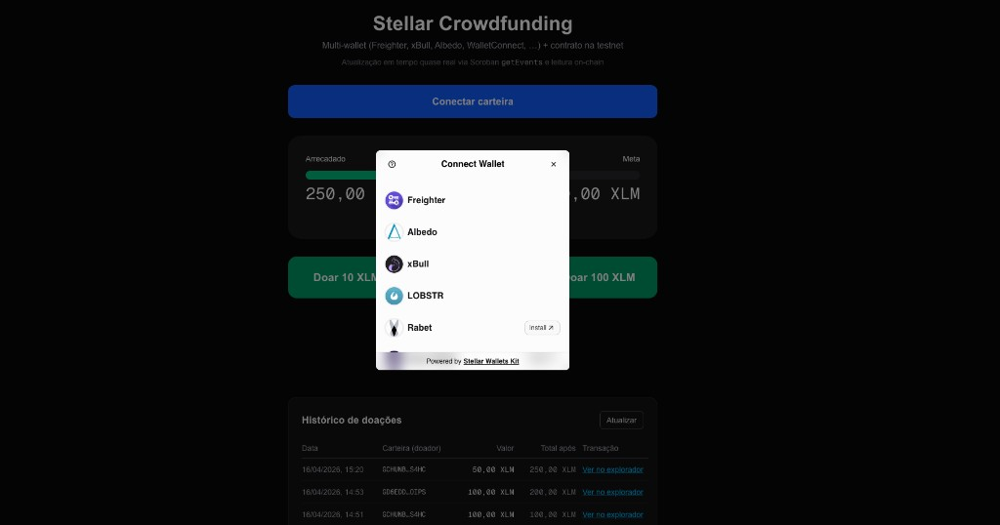

# Soroban Project

## Demo — Crowdfunding Stellar (testnet)

- **Aplicação (Vercel):** [https://crowdfund-stellar-5hwb.vercel.app/](https://crowdfund-stellar-5hwb.vercel.app/)
- **Vídeo da demonstração:** [https://youtu.be/nkGo3x-q_8A](https://youtu.be/nkGo3x-q_8A)
- **Transação de exemplo (chamada ao contrato Soroban):** [https://stellar.expert/explorer/testnet/tx/bd2b0c531683ab4d52acdd1e98224341a763b436c7ef3bc9948623266773b9fa](https://stellar.expert/explorer/testnet/tx/bd2b0c531683ab4d52acdd1e98224341a763b436c7ef3bc9948623266773b9fa) (hash `bd2b0c531683ab4d52acdd1e98224341a763b436c7ef3bc9948623266773b9fa`)



## Project Structure

This repository uses the recommended structure for a Soroban project:

```text
.
├── contracts
│   └── hello_world
│       ├── src
│       │   ├── lib.rs
│       │   └── test.rs
│       └── Cargo.toml
├── Cargo.toml
└── README.md
```

- New Soroban contracts can be put in `contracts`, each in their own directory. There is already a `hello_world` contract in there to get you started.
- If you initialized this project with any other example contracts via `--with-example`, those contracts will be in the `contracts` directory as well.
- Contracts should have their own `Cargo.toml` files that rely on the top-level `Cargo.toml` workspace for their dependencies.
- Frontend libraries can be added to the top-level directory as well. If you initialized this project with a frontend template via `--frontend-template` you will have those files already included.

## Frontend (Next.js)

O app web fica em **`crowdfund-next/`** (Stellar / Soroban + carteiras).

### Vercel

Configure o **Root Directory** do projeto na Vercel como **`crowdfund-next`**. Sem isso, o deploy costuma dar **404**. Passo a passo: [`DEPLOY_VERCEL.md`](./DEPLOY_VERCEL.md).
